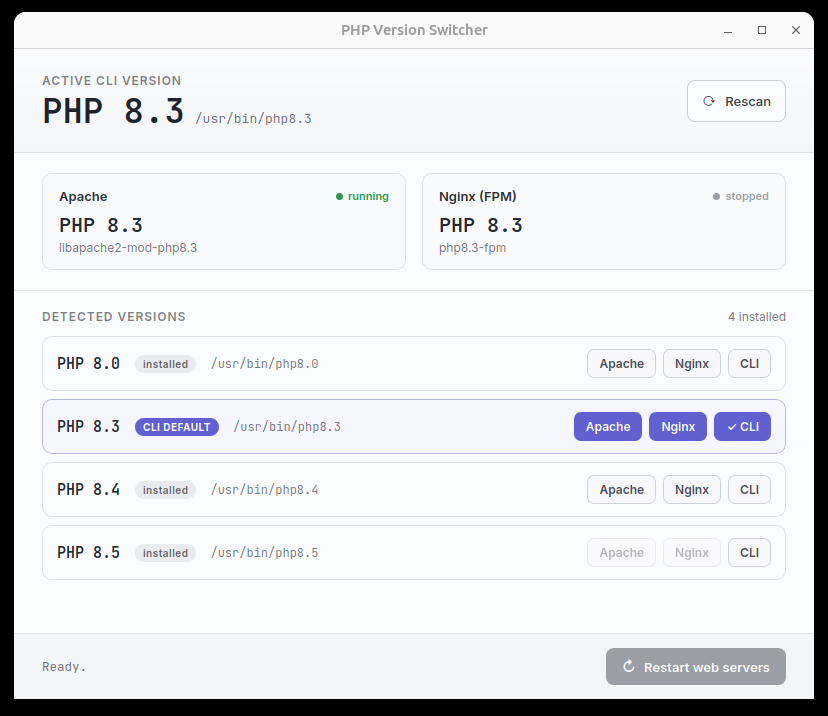

# phpswitch-desktop

A native desktop app (and CLI) for switching the active PHP version on Ubuntu and macOS —
CLI, Apache2 mod_php, PHP-FPM, and Nginx, all in one click.


[](https://github.com/afiez97/phpswitch-desktop/releases)

<br clear="left">



> Looking for the terminal-only version? See
> [afiez97/phpswitch](https://github.com/afiez97/phpswitch). This repo builds on that same
> CLI and adds a native GUI on top of it.

---

## Compatibility

| | Ubuntu | macOS |
|---|---|---|
| Tested on | 24.04 (amd64) | not yet — see [Troubleshooting](#macos-switching-isnt-verified-yet) |
| `.deb` | needs `libwebkit2gtk-4.1-0` — available on **22.04+/24.04**; likely won't install cleanly on 20.04 | — |
| `.AppImage` | bundles its own WebKit, so more portable across Ubuntu versions; needs `libfuse2` to double-click (or run with `--appimage-extract-and-run`) | — |
| `.dmg`/`.app` | — | any recent macOS, amd64/arm64 build produced by CI |

Only `amd64` builds are currently published — no ARM (e.g. Raspberry Pi Ubuntu) build yet.

---

## Install

Two separate pieces, both required on Ubuntu: the **CLI** (does the actual switching) and the
**desktop app** (the GUI on top of it). On macOS you only need the desktop app.

### Step 1 — Ubuntu: install the CLI

Download `phpswitch_*_all.deb` from **[Releases](https://github.com/afiez97/phpswitch-desktop/releases)**, then in a terminal:

```bash
sudo dpkg -i phpswitch_*_all.deb
sudo apt-get install -f
```

(the second command only does something if the first one complained about missing dependencies)

Check it worked:

```bash
phpswitch --status
```

You should see your current PHP versions printed — if you instead see a "command not found",
the install didn't take; re-run the two commands above and check for errors.

### Step 2 — install the desktop app

**Ubuntu**, download `phpswitch-desktop_*_amd64.deb` from Releases, then:

```bash
sudo dpkg -i phpswitch-desktop_*_amd64.deb
sudo apt-get install -f
```

It'll then appear in your app menu/search as **"phpswitch-desktop"**. Prefer not to install
anything system-wide? Download the `.AppImage` instead:

```bash
chmod +x phpswitch-desktop_*_amd64.AppImage
./phpswitch-desktop_*_amd64.AppImage
```

**macOS**: download `phpswitch-desktop_*.dmg` from Releases, open it, drag the app to
Applications. Needs [Homebrew](https://brew.sh) with a `php`/`php@X.Y` formula already
installed — no CLI package required.

> Building from source instead of downloading a release? See
> [Building from source](#building-from-source) below.

---

## Features

- One-click switching from a native app window — no browser, no terminal
- Switches PHP for **all components at once**: CLI, Apache2, PHP-FPM, Nginx (Linux) /
  Homebrew services (macOS)
- Auto-detects all installed PHP versions
- Auto-updates the Nginx `fastcgi_pass` socket to match the active FPM version (Linux)
- Shows which versions have Apache module / FPM support available
- Also usable as a plain terminal CLI (`phpswitch`) if you don't want the GUI

---

## Usage

### Desktop app

Launch it from your app menu (after installing the `.deb`/`.dmg`) or run the `.AppImage`
directly. Click a version's **CLI**/**Apache**/**Nginx** button to switch that target;
**Restart web servers** applies pending Apache/Nginx changes; **Rescan** re-reads installed
versions.

### CLI

```bash
sudo phpswitch              # interactive menu
sudo phpswitch 8.3          # switch CLI + Apache + PHP-FPM + Nginx to PHP 8.3
phpswitch --status          # show current status (no sudo needed)
phpswitch --json-status     # same, as JSON
phpswitch --help
```

```
  PHP Version Status
──────────────────────────────────────────
  CLI       PHP 8.3
  Apache    mod_php8.3  (active)
  PHP-FPM   php8.3-fpm  (active)
  Nginx     active
──────────────────────────────────────────
  Installed PHP versions:
    PHP 8.0 [apache] [fpm]
    PHP 8.3 [apache] [fpm]  ← CLI  ← Apache
    PHP 8.4 [apache] [fpm]
    PHP 8.5
```

---

## What gets switched

| Component | Ubuntu | macOS |
|---|---|---|
| **CLI** | `update-alternatives --set php /usr/bin/php<ver>` | `brew link --force --overwrite php@<ver>` |
| **CLI tools** | `phpize`, `php-config`, `phar`, `phar.phar`, `php-cgi` | — |
| **Apache2** | Disables active `mod_phpX.Y`, enables `mod_php<ver>`, restarts `apache2` | not applicable (no Homebrew equivalent) |
| **PHP-FPM** | Stops other `phpX.Y-fpm`, starts `php<ver>-fpm` | `brew services stop/start php@<ver>` |
| **Nginx socket** | Updates `fastcgi_pass` in `sites-enabled/*` | not automated yet |
| **Nginx** | Reloads after config test | `brew services restart nginx` |

---

## Requirements

| Requirement | Ubuntu | macOS |
|---|---|---|
| OS | 22.04, 24.04 (the CLI itself works on 20.04 too; the desktop app's `.deb` needs 22.04+ — see [Compatibility](#compatibility)) | recent macOS with [Homebrew](https://brew.sh) |
| PHP versions | via `ondrej/php` PPA or `apt` | via `brew install php@X.Y` |
| Web servers | Apache2 and/or Nginx (either, both, or neither) | Nginx via Homebrew (optional) |

Installing more PHP versions on Ubuntu:

```bash
sudo add-apt-repository ppa:ondrej/php
sudo apt update
sudo apt install php8.4 php8.4-fpm php8.4-cli libapache2-mod-php8.4
```

On macOS:

```bash
brew install php@8.4
```

---

## What the sudoers rule grants

The desktop app needs root for `update-alternatives`, `a2enmod`/`a2dismod`, and `systemctl`
on Linux. Rather than running the whole app as root, the `.deb` installs
`/etc/sudoers.d/phpswitch`, which grants passwordless `sudo` for exactly these four commands
and nothing else:

```
/usr/bin/phpswitch --set-cli <version>
/usr/bin/phpswitch --set-apache <version>
/usr/bin/phpswitch --set-fpm <version>
/usr/bin/phpswitch --restart-services
```

Each of these validates its version argument (`\d+\.\d+`) and checks the PHP binary actually
exists before doing anything — see `validate_version_arg` in the `phpswitch` script. Review
`/etc/sudoers.d/phpswitch` yourself before relying on it; remove it
(`sudo rm /etc/sudoers.d/phpswitch`) if you'd rather be prompted for a password on every switch.

macOS needs no such rule — Homebrew operates entirely as the logged-in user.

---

## Uninstall

**Desktop app**: uninstall like any other app (`sudo dpkg --purge phpswitch-desktop` if
installed via `.deb`; drag to Trash on macOS).

**CLI**:

```bash
sudo dpkg --purge phpswitch   # also removes /etc/sudoers.d/phpswitch
```

Or, if installed via `install.sh`:

```bash
sudo bash uninstall.sh
```

---

## Troubleshooting

### Apache fails to restart
Run `sudo apache2ctl configtest` to find config errors.

### Nginx config test fails
The tool skips the Nginx reload if `nginx -t` fails. Run `sudo nginx -t` to see the error.

### PHP-FPM not found for a version
The CLI will warn and show the install command — a version may be installed without its
`-fpm` package yet.

### Switch works but Composer still shows the old version
Composer reads `php` from `PATH`. Open a new terminal or run `hash -r` to refresh it.

### Desktop app: "Passwordless sudo isn't set up for phpswitch"
Reinstall the CLI's `.deb` (`sudo dpkg -i phpswitch_*_all.deb`) — it installs the sudoers
rule described above.

### Desktop app doesn't show up in app search after installing
First confirm it's actually installed — `dpkg -l | grep phpswitch-desktop` and
`ls /usr/share/applications/phpswitch-desktop.desktop` should both show something. If they
don't, the `.deb` install didn't actually run (a common mistake: pasting a command that was
only *shown* as an example, rather than typing it directly — make sure you're running
`sudo dpkg -i ...` yourself, not `echo`-ing it). If both checks pass but search still doesn't
find it, refresh the caches and restart the shell:
```bash
sudo update-desktop-database /usr/share/applications
sudo gtk-update-icon-cache -f -t /usr/share/icons/hicolor
```
then log out and back in (Wayland) or press `Alt+F2` → `r` → Enter (X11).

### macOS: switching isn't verified yet
The macOS backend (`desktop/src-tauri/src/macos.rs`) was developed without access to a real
Mac. If something doesn't behave as expected, please open an issue.

---

## Building from source

- **CLI + `.deb`**: `./build-deb.sh` at the repo root (see [`build-deb.sh`](build-deb.sh)).
- **Desktop app**: see [`desktop/README.md`](desktop/README.md) for prerequisites and build
  steps on both platforms, plus how the `.github/workflows/desktop-build.yml` CI release
  pipeline works.

---

## Author

**afiez** — [github.com/afiez97](https://github.com/afiez97)

---

## License

[MIT](LICENSE)
